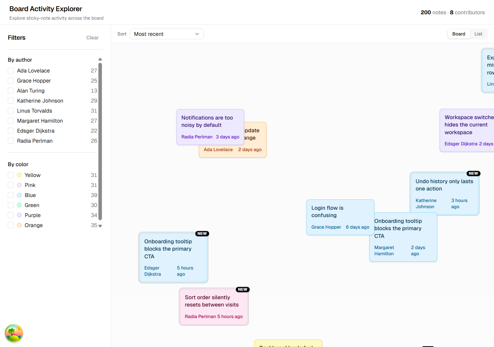

# Board Activity Explorer

Frontend take-home for Mural. A desktop web app for exploring sticky-note activity on a collaborative board — visualise notes in their spatial context, filter by author and colour, sort by recency / position / author, highlight notes from the last 24 hours, and flip to a list view when you want the grid.



---

## Deliverables

- **Source code** — this repo. Ten atomic commits, one per stage, describing exactly what shipped and why.
- **[WRITE-UP.md](./WRITE-UP.md)** — the short answers to the brief's questions (approach, assumptions, architecture, perf + a11y, UX, AI usage, tradeoffs, time).
- **[DECISIONS.md](./DECISIONS.md)** — the long-form stage-by-stage rationale, audit findings, and memoisation notes.
- **Screenshots per stage** in [`docs/screenshots/`](./docs/screenshots/).

---

## Quick start

Prereqs: Node `>= 20` and pnpm `>= 9` (`npm install -g pnpm`).

```bash
pnpm install
pnpm exec playwright install chromium
pnpm dev                    # http://localhost:5173
```

First launch may take a few seconds while the MSW service worker registers; after that every request to `/api/notes` is intercepted and served from a deterministic 200-note fixture.

### Test suite

```bash
pnpm test:run               # Vitest unit + integration (89 tests)
pnpm test:e2e               # Playwright against chromium (18 specs)
pnpm test:coverage          # V8 coverage report in coverage/
```

`pnpm test` (no `:run`) drops into Vitest's watch mode; `pnpm test:e2e:ui` opens the Playwright trace viewer.

### Lint / format / typecheck

```bash
pnpm typecheck              # tsc --noEmit via project references
pnpm lint                   # ESLint flat config
pnpm format                 # Prettier write (tailwindcss plugin sorts classes)
pnpm build                  # tsc -b && vite build
```

A Husky pre-commit hook runs `lint-staged` (`eslint --fix` + `prettier --write` on staged files) so commits land clean.

---

## What's in the box

- **Spatial board** — 200 deterministic notes positioned on a 4000×3000 canvas, pan with mouse drag or keyboard (arrow keys, `Home` to recenter).
- **Filter by author** (multi-select) and **by colour** (chips with swatches). Per-option counts preview what each filter would reveal.
- **Sort** — most recent / oldest / author A–Z / position — with stable tie-breakers so results never look random.
- **"New" badge** on notes under 24 hours old, plus a subtle focus-ring. Window is configurable.
- **List view toggle** — segmented control (board vs list) persisted in `localStorage` via Zustand. Every filter and sort still applies; filtered notes that were off-screen in the spatial view show up in the grid.
- **Reveal on board** — every list item has a "Show on board" icon button. Clicking it writes `?focus=<id>` to the URL, flips the view to board, centres the canvas on the target, and flashes a highlight ring for ~2.5 s. Deep-linkable (`/?focus=note_0042` lands already-centred).
- **Zoom** — mouse wheel zooms anchored to the cursor (no modifier needed on the canvas), keyboard shortcuts are `+` / `-` for step zoom and `0` to reset. Scale is clamped to `[0.3, 3]`.
- **Responsive** — below `md` the sidebar collapses into a Sheet behind a "Filters" trigger in the toolbar; header subtitle hides; touch targets on filter rows are padded out. Same feature set on a 360 px phone as on 1440 px desktop.
- **Dark mode** — `light` / `dark` / `system` cycling toggle in the header (Sun / Moon / Monitor). `system` respects `prefers-color-scheme` and auto-updates when the OS flips. Choice is persisted in `localStorage` via Zustand. Note palette adapts across 6 colours with dedicated `dark:` tokens — no bright sticky notes shouting on a dark canvas.
- **URL state** — filters and sort are synced to the query string via `nuqs`, with typed parsers that reject unknown values. Reload-safe, share-safe.
- **State branches** — loading skeleton, empty board, error with retry, no-matches-for-filters with a clear action. Each is its own sub-component with its own `data-testid`.
- **Keyboard-only path** — a skip-to-board link, a focusable region, and arrow-key pan mean the canvas works without a mouse.
- **Viewport culling** — at the default 1280×720 viewport only ~29 of 200 notes render in the DOM.
- **Devtools** — React Query devtools mount in dev builds (bottom-left).

## Stack

| Concern                  | Choice                                                                              |
| ------------------------ | ----------------------------------------------------------------------------------- |
| Build                    | [Vite](https://vitejs.dev) + React 19 + TypeScript                                  |
| Styling                  | [Tailwind CSS v4](https://tailwindcss.com) (CSS-first config, `@tailwindcss/vite`)  |
| Components               | [shadcn/ui](https://ui.shadcn.com) (Radix primitives, owned in `src/components/ui`) |
| Server state             | [TanStack Query](https://tanstack.com/query)                                        |
| URL state                | [nuqs](https://nuqs.47ng.com) with typed parsers                                    |
| Client state             | [Zustand](https://zustand.docs.pmnd.rs) with the `persist` middleware               |
| Mock API                 | [MSW](https://mswjs.io) — the only backend, swappable in one file                   |
| Unit / integration tests | [Vitest](https://vitest.dev) + [React Testing Library](https://testing-library.com) |
| End-to-end tests         | [Playwright](https://playwright.dev) (chromium, auto-starts the dev server)         |
| Lint / format            | ESLint 10 flat config · Prettier · `prettier-plugin-tailwindcss`                    |
| Git hooks                | Husky + lint-staged                                                                 |

Why these specifically: see [`DECISIONS.md`](./DECISIONS.md).

---

## Project structure

```
src/
  App.tsx                       # shell: header + filter sidebar + toolbar + main
  main.tsx                      # MSW bootstrap, QueryClient + Nuqs providers
  index.css                     # Tailwind entry + shadcn tokens (light + dark)
  components/
    ui/                         # vendored shadcn/ui primitives
  lib/
    query-client.ts             # TanStack Query factory with explorer-tuned defaults
    relative-time.ts            # Intl.RelativeTimeFormat helper
    use-element-size.ts         # ResizeObserver hook for viewport culling
    utils.ts                    # cn() helper
  features/
    notes/
      api/notes-query.ts        # useNotesQuery (fetcher + hook)
      components/
        note-board.tsx          # spatial board, state branches, pan, culling
        note-card.tsx           # sticky on the spatial canvas
        note-list.tsx           # responsive grid view
        note-list-item.tsx      # sticky in list mode
        sort-select.tsx         # URL-bound dropdown
      hooks/
        use-board-pan.ts        # pointer + keyboard pan, zoom, setOffset
        use-board-sort.ts       # nuqs-backed sort state
        use-board-focus.ts      # nuqs-backed focused-note id
      lib/
        note-colors.ts          # NoteColor → palette classes
        recency.ts              # isRecentNote
        sort-notes.ts           # pure sort with stable tie-breakers
        viewport-culling.ts     # pure isNoteVisible (scale-aware)
        center-on-note.ts       # pure offset-to-centre for reveal
      types.ts
    filters/
      api/use-board-filters.ts  # nuqs-backed multi-select state
      components/
        filter-bar.tsx          # sidebar
        author-filter.tsx       # fieldset + checkboxes
        color-filter.tsx        # fieldset + swatches
        color-dot.tsx
      lib/
        filter-counts.ts        # pure aggregation
        filter-notes.ts         # pure filter
      types.ts
    view-mode/
      store.ts                  # Zustand + persist (localStorage)
      components/view-mode-toggle.tsx
    theme/
      store.ts                  # Zustand + persist, light|dark|system
      components/
        theme-sync.tsx          # applies .dark class, listens to OS
        theme-toggle.tsx        # cycling Sun/Moon/Monitor button
    filters/components/mobile-filter-sheet.tsx  # drawer wrapper for < md
  mocks/
    browser.ts                  # MSW service-worker client
    server.ts                   # MSW node server (tests)
    handlers.ts                 # shared handlers
    data/notes.ts               # Mulberry32-seeded 200-note fixture
  test/
    setup.ts                    # Vitest + RTL + MSW lifecycle
    utils.tsx                   # renderWithClient / renderHookWithClient

tests/
  e2e/
    smoke.spec.ts
    filters.spec.ts
    sort-and-view.spec.ts
    a11y.spec.ts
    reveal.spec.ts              # list → board reveal + deep-link
    zoom.spec.ts                # wheel + keyboard zoom
    mobile.spec.ts              # narrow-viewport sheet + URL sync
    theme.spec.ts               # light / dark / system cycle + persist
```

Every feature co-locates its components, hooks, store slice, API layer, pure helpers, and tests. Lint rules skip `src/components/ui/` because those files are vendored shadcn primitives.

---

## Testing philosophy

Three layers, each doing the job it is best at:

| Layer       | Tool                           | What it covers                                                                                                                                |
| ----------- | ------------------------------ | --------------------------------------------------------------------------------------------------------------------------------------------- |
| Unit        | Vitest                         | Pure functions (filter, sort, cull geometry, recency, relative-time) and the Zustand slice                                                    |
| Integration | Vitest + React Testing Library | Components wired to a real `QueryClient` and the nuqs testing adapter, asserted through ARIA roles                                            |
| End-to-end  | Playwright (chromium)          | Critical user flows: render, filter + URL reload, clear-all, sort, list view, keyboard pan, skip link, reveal-on-board, wheel / keyboard zoom |

Accessibility is treated as a first-class test concern — every query is role- or label-based, so missing semantics break tests first, humans second.

---

## Stage plan (all complete)

| Stage | Deliverable                                                | Status |
| ----- | ---------------------------------------------------------- | ------ |
| 1     | Scaffold, tooling, design system, smoke tests              | ✅     |
| 2     | Notes domain types, MSW mock, TanStack Query hook          | ✅     |
| 3     | Spatial board view with note component                     | ✅     |
| 4     | Author + colour filters, URL-synced state                  | ✅     |
| 5     | Sort options + recent-activity highlighting + list view    | ✅     |
| 6     | Performance pass (viewport culling, memoisation)           | ✅     |
| 7     | Accessibility pass (`impeccable:audit` 14 → 15 / 20)       | ✅     |
| 8     | Write-up + README polish                                   | ✅     |
| 9     | List → board reveal (`?focus=note_id`, centre + highlight) | ✅     |
| 10    | Wheel + keyboard zoom on the spatial canvas                | ✅     |
| 11    | Docs housekeeping (counts, structure, next steps)          | ✅     |
| 12    | Mobile responsive (sheet sidebar, stacked toolbar)         | ✅     |
| 13    | Dark mode (light / dark / system, persisted, full palette) | ✅     |

Each stage is a single atomic commit (`git log --oneline`).

---

## Further reading

- **[`WRITE-UP.md`](./WRITE-UP.md)** — the short write-up answering the brief.
- **[`DECISIONS.md`](./DECISIONS.md)** — the long version, stage by stage.
